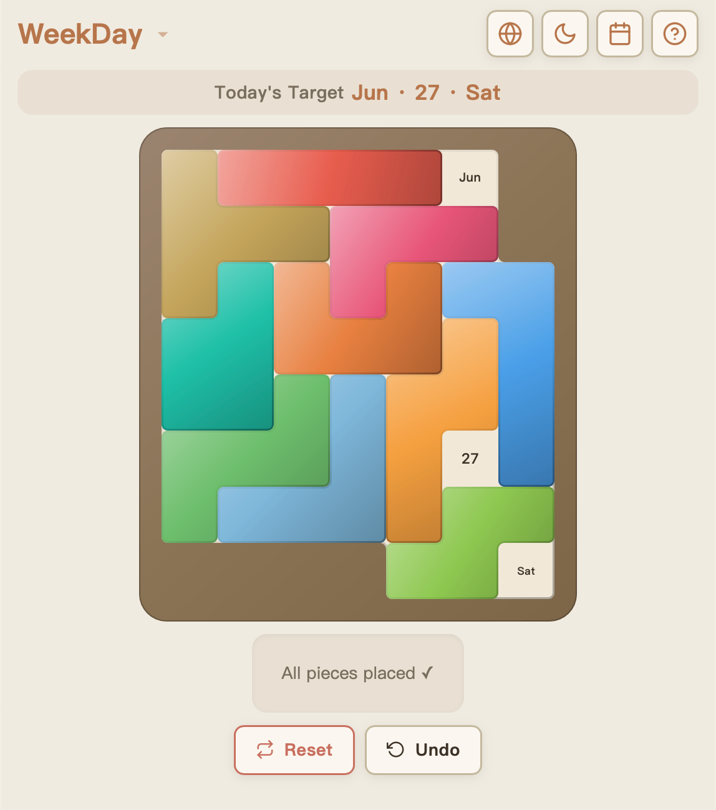

# A Puzzle A Day

每天一块拼图 — 用不同形状的拼块填满托盘，让未覆盖的格子恰好显示今天的月份、日期和星期。

A daily polyomino puzzle — fit pieces into the tray so that the uncovered cells reveal today's month, day, and weekday.

**在线体验 / Live Demo:** [1p1d.hanasaka.net](https://1p1d.hanasaka.net)



## 玩法 / How to Play

- **拖拽** 将拼块从拼块区拖到托盘上，或从托盘上拖回拼块区
- **单击** 翻转拼块（镜像）
- **双击** 旋转拼块 90°
- 目标：用给定拼块恰好覆盖所有日期格，只留下**今天的日期**（月份 + 日期 + 星期）可见

> **Drag** pieces from the bank to the tray. **Click** to flip. **Double-click** to rotate.  
> Goal: leave only **today's cells** uncovered.

## 特性 / Features

- 🧩 **4 种拼图变体** — DragonFjord, JarringWords, TheRammer, WeekDay Calendar Puzzle
- 🌐 **9 种语言** + 跟随系统 — 中文、English、日本語、한국어、Русский、Français、Deutsch、Italiano、Magyar
- 🌗 **明暗主题** — 浅色 / 深色 / 自动跟随系统
- 📅 **日历历史** — 查看任意日期的拼图完成记录，一键回溯
- ↩️ **撤销 / 重置** — 支持撤销操作和重置当天拼图
- 📱 **响应式布局** — 自适应横屏和竖屏
- 🎨 **Canvas 渲染** — 带有斜面渐变和内描边的精美拼块

## 技术栈 / Tech Stack

纯前端，零依赖，开箱即用。

| | |
|---|---|
| HTML / CSS / JavaScript | 原生实现，无框架 |
| Canvas 2D API | 拼块与托盘渲染 |
| localStorage | 游戏状态持久化 |
| CSS Custom Properties | 主题切换 |

## 本地运行 / Run Locally

```bash
# 任意静态文件服务器均可
python3 -m http.server 8080
# 或
npx serve .
```

打开浏览器访问 `http://localhost:8080`

## AI 生成声明 / AI Attribution

本项目代码由 **DeepSeek V4 Pro** 生成，经由 **Claude Code** 交互式驱动和迭代完善。

设计灵感来自 [hanasaka.net](https://hanasaka.net)。

> This project was generated by **DeepSeek V4 Pro** and iteratively refined through **Claude Code**.
> Design inspiration from [hanasaka.net](https://hanasaka.net).

## 协议 / License

[CC BY-NC 4.0](LICENSE) — 可复制、修改、分发，但**不可商用**，且**必须注明来源**。

Creative Commons Attribution-NonCommercial 4.0 International — you may share and adapt this work for non-commercial purposes with proper attribution.
